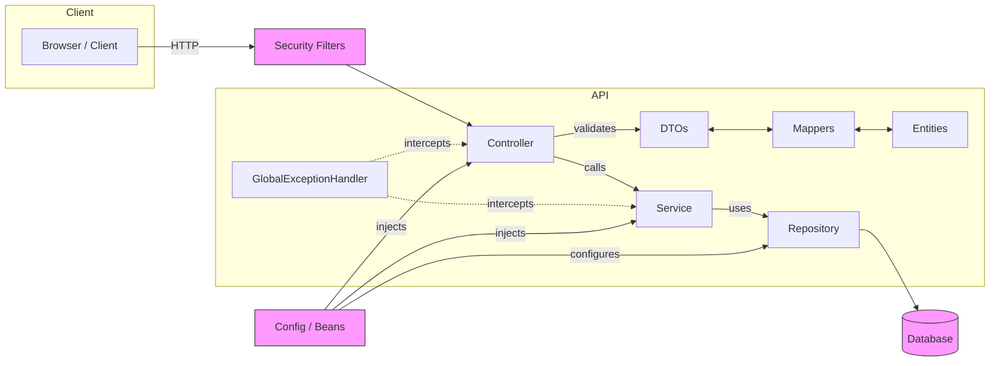

# Sobre
Este projeto é uma **API RESTful** projetada para **gerenciar** colaboradores, agendas e registros diários, oferecendo **operações completas de CRUD** e **processamento interno de dados**. Esta versão da API é voltada para uso em **ambiente de desenvolvimento e testes**, garantindo que as informações sejam **validadas**, **tratadas** e **armazenadas** corretamente no banco de dados.

Se você deseja consultar a **API oficial da AIDA**, utilizada em produção e integrada à plataforma principal, clique [aqui](https://github.com/Shiny-Syntax/aida-apiRESTful-BackEnd).

## Como rodar e testar o projeto na sua máquina
### PRÉ-REQUISITOS
- [**Java 21+**](https://www.oracle.com/java/technologies/downloads/)
- [**Maven 3.9.11+**](https://maven.apache.org/download.cgi)
### PASSO A PASSO
**1.** **Clone o repositório**

Escolha ou crie uma pasta onde você quer guardar o projeto e abra o terminal nela. Depois, execute:
```bash
git clone https://github.com/Shiny-Syntax/aida-apiRESTful.git
```
Isso vai criar uma pasta chamada aida-apiRESTful com todos os arquivos do projeto.

**2.** **Acesse a pasta do projeto**

Entre na pasta do projeto recém-clonada:
```bash
cd aida-apiRESTful
```
**3. Rodar o projeto**

Se você já tiver o Java e Maven instalados, basta executar:
```
mvn spring-boot:run
```
Isso vai iniciar a API localmente. Por padrão, ela deve ficar disponível em:
```
http://localhost:8080
```
e para testar os endpoints com maior facilidade, recomendamos que acesse:
```
http://localhost:8080/swagger-ui/index.html
```

# Conheça o projeto
## Funcionalidades Principais 
- **CRUD completo** para todas as entidades da aplicação.
- **Validação de dados** estruturada via DTOs e Bean Validation.
- **Logs detalhados** para depuração e rastreabilidade das operações.
- **Regras de negócio aplicadas** para garantir consistência e integridade dos dados.
- **Pipeline de tratamento e normalização** antes da persistência.
- **Persistência** gerenciada pelo JPA, com mapeamento automático das entidades.
- **Banco H2 configurado** para desenvolvimento, oferecendo isolamento e inspeção rápida via console.
- **Schema gerado e atualizado automaticamente** pelo Hibernate durante o ciclo de desenvolvimento.
- **Retorno de códigos HTTP padronizados** (2xx, 3xx, 4xx, 5xx) com documentação clara e consistente.



